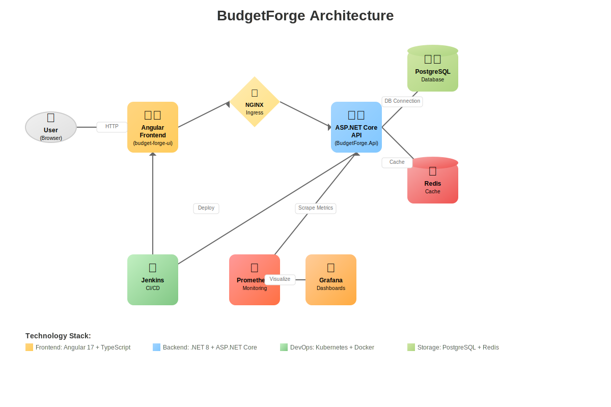

# BudgetForge 💰

A production-ready, enterprise-grade personal finance tracker built for the modern developer

[](https://github.com/BackendCowboy/BudgetForge)
[](LICENSE)
[](https://dotnet.microsoft.com/)
[](https://angular.io/)
[](https://kubernetes.io/)

A **full-stack, DevOps driven personal finance tracker** built with **C# ASP.NET Core**, **Angular**, and an enterprise grade backend architecture. Fully containerized, orchestrated in **Kubernetes**, secured with **Argon2id password hashing**, and monitored with **Prometheus + Grafana**. CI/CD is automated via **Jenkins**.

## 🚀 Project Overview

BudgetForge is designed to scale from personal use to multi-tenant SaaS, combining:

- **Clean Architecture** and DDD for maintainable backend code
- **Angular frontend** for a responsive user experience
- **Secure authentication** with Argon2id password hashing
- **DevOps first infrastructure**: Kubernetes, Jenkins, Ingress, monitoring stack

## 🏗 Architecture

### Directory Structure

```text
BudgetForge/
├── src/                           # Backend - Clean Architecture
│   ├── BudgetForge.Domain/        # Entities, enums
│   ├── BudgetForge.Application/   # Business logic, DTOs, validation
│   ├── BudgetForge.Infrastructure/# DB, Identity (Argon2id), external services
│   └── BudgetForge.Api/           # ASP.NET Core Web API
├── frontend/budget-forge-ui/      # Angular frontend
├── infra/k8s/                     # Kubernetes manifests
├── docker/                        # Service configs
├── docker-data/                   # Persisted volumes
├── jenkins/                       # Jenkins Dockerfile + scripts
├── Jenkinsfile                    # CI/CD pipeline
├── scripts/                       # Utility scripts
└── tests/                         # Unit & integration tests
```

## 🏗️ System Architecture



Enterprise grade architecture showcasing Clean Architecture principles, microservices patterns, and cloud native deployment strategies

### Architecture Highlights

- **Clean Architecture**: Domain driven design with clear separation of concerns
- **Event Driven**: Asynchronous processing with Redis pub/sub
- **Observability**: Comprehensive monitoring with Prometheus + Grafana
- **Security First**: Argon2id encryption and JWT authentication
- **Cloud Native**: Kubernetes ready with horizontal scaling capabilities

## 🛠 Tech Stack

### Backend

- C# (.NET 8, ASP.NET Core)
- PostgreSQL
- Redis
- Argon2id password hashing (Konscious.Security.Cryptography)

### Frontend

- Angular 17 (SCSS, TypeScript)

### Infrastructure and DevOps

- Docker, Docker Compose
- Kubernetes (kind for local dev)
- NGINX Ingress Controller
- Prometheus + Grafana (kube-prometheus-stack)
- metrics-server
- Jenkins (pipeline in Jenkinsfile)
- Lens (Kubernetes dashboard)

## 🔒 Security

- Argon2id password hashing for user credentials
- Configurable hashing parameters (iterations, memory, parallelism)
- Centralized Identity layer for authentication

## 📊 Monitoring

- Prometheus scraping API /metrics
- Grafana dashboards (API performance, cluster metrics)
- metrics-server for CPU/RAM usage
- Ready for Redis and Postgres exporters

## ⚙️ CI/CD with Jenkins

- **Stages**: Build → Test → Dockerize → Push to registry → Deploy to Kubernetes
- Jenkins containerized with jenkins/ Dockerfile
- Pre-configured with Prometheus metrics plugin for build monitoring
- Pipeline logic stored in Jenkinsfile

## 🖥 Local Development Setup

### Prerequisites

- .NET 8 SDK
- Node.js 20+ and Angular CLI
- Docker Desktop
- kind (Kubernetes in Docker)
- kubectl
- Lens (optional, for cluster visualization)

### Development Options

#### Option 1: Local Development (Simple)

1. **Clone the repository**

   ```bash
   git clone https://github.com/yourusername/budgetforge.git
   cd budgetforge
   ```

2. **Run locally with Docker Compose**

   ```bash
   # Start backend services (PostgreSQL, Redis)
   docker compose up -d postgres redis
   
   # Build and run API
   cd src/BudgetForge.Api
   dotnet restore
   dotnet run
   
   # Build and run frontend (in separate terminal)
   cd frontend/budget-forge-ui
   npm install
   ng serve
   ```

3. **Access the application**
   - Frontend: <http://localhost:4200>
   - API: <http://localhost:5000/swagger>

#### Option 2: Full Kubernetes Deployment

1. **Create kind cluster**

   ```bash
   kind create cluster --name budgetforge
   ```

2. **Create namespace**

   ```bash
   kubectl apply -f infra/k8s/base/namespace.yaml
   ```

3. **Load API image into kind**

   ```bash
   docker build -t budgetforge-api:kind -f src/BudgetForge.Api/Dockerfile .
   kind load docker-image budgetforge-api:kind --name budgetforge
   ```

4. **Deploy services**

   ```bash
   kubectl apply -f infra/k8s/base/
   ```

5. **Setup ingress host mapping**

   ```bash
   echo "127.0.0.1 api.budgetforge.local" | sudo tee -a /etc/hosts
   echo "127.0.0.1 grafana.budgetforge.local" | sudo tee -a /etc/hosts
   ```

6. **Access the application**
   - API: <http://api.budgetforge.local>
   - Grafana: <http://grafana.budgetforge.local>

## 🔍 Monitoring Stack Setup

Install Prometheus + Grafana using Helm:

```bash
helm repo add prometheus-community https://prometheus-community.github.io/helm-charts
helm install kube-prom-stack prometheus-community/kube-prometheus-stack \
  --namespace monitoring --create-namespace
```

**Grafana Access:**

- URL: <http://grafana.budgetforge.local>
- Username: `admin`
- Password: `prom-operator`

## 🔄 Jenkins CI/CD Setup

1. **Build and run Jenkins**

   ```bash
   docker compose up -d jenkins
   ```

2. **Access Jenkins**
   - URL: <http://localhost:8082>
   - Configured with pipeline from `Jenkinsfile`
   - Pre-configured with Prometheus metrics plugin

## 🧪 Testing

```bash
# Run backend tests
dotnet test tests/

# Run frontend tests
cd frontend/budget-forge-ui
npm run test

# Run integration tests
dotnet test tests/BudgetForge.IntegrationTests/
```

## 🚀 Production Deployment

### Using Jenkins Pipeline

```bash
# Trigger pipeline (webhook or manual)
# Jenkins will handle: build → test → dockerize → deploy
```

### Manual Kubernetes Deployment

```bash
# Build and push images
docker build -t budgetforge-api:latest .
docker build -t budgetforge-ui:latest frontend/budget-forge-ui/

# Deploy to cluster
kubectl apply -f infra/k8s/production/
```

## 📈 Key Features

- **Expense Tracking**: Categorize and monitor spending patterns
- **Budget Management**: Set and track budget goals
- **Responsive Design**: Works seamlessly on desktop and mobile
- **Secure Authentication**: Industry-standard password hashing
- **Analytics Dashboard**: Visualize spending trends and insights
- **Multi-tenant Ready**: Scalable architecture for SaaS deployment

## 🤝 Contributing

1. Fork the repository
2. Create a feature branch (`git checkout -b feature/amazing-feature`)
3. Commit your changes (`git commit -m 'Add amazing feature'`)
4. Push to the branch (`git push origin feature/amazing-feature`)
5. Open a Pull Request

## 📝 Environment Variables

### Backend (.NET)

```bash
ConnectionStrings__DefaultConnection="Server=localhost;Database=budgetforge;..."
Redis__ConnectionString="localhost:6379"
Argon2__MemorySize=65536
Argon2__Iterations=3
Argon2__Parallelism=1
```

### Frontend (Angular)

```bash
ENVIRONMENT=development
API_BASE_URL=http://localhost:5000/api
```

## 🐛 Troubleshooting

### Common Issues

- **Port conflicts**: Ensure ports 4200, 5000, 3000, 9090 are available
- **Kind cluster issues**: Run `kind delete cluster --name budgetforge` and recreate
- **Database connection**: Verify PostgreSQL is running in the cluster

### Logs

```bash
# API logs
kubectl logs deployment/budgetforge-api

# Frontend logs (during development)
ng serve --verbose

# Jenkins logs
kubectl logs deployment/jenkins
```

## 🗺️ Roadmap

### Upcoming Features

- **HPA (Horizontal Pod Autoscaler)** for API scaling
- **Deploy PostgreSQL** inside Kubernetes cluster
- **Enhanced Monitoring**: Redis and PostgreSQL Grafana dashboards
- **Core Features**: Transaction and budget management in backend
- **UI Integration**: Complete Angular frontend with API connectivity
- **Cloud Deployment**: Terraform modules for AWS/Azure/GCP

### Development Priorities

1. **Backend API completion** - CRUD operations for transactions and budgets
2. **Frontend integration** - Connect Angular UI to backend services
3. **Advanced monitoring** - Custom dashboards and alerting rules
4. **Cloud native deployment** - Infrastructure as Code with Terraform
5. **Performance optimization** - Caching strategies and database indexing

## 📄 License

This project is licensed under the **MIT License** - see the [LICENSE](LICENSE) file for details.

## ⭐ Acknowledgments

- Clean Architecture principles by Robert C. Martin
- Kubernetes community for excellent tooling
- Angular and .NET Core teams for robust frameworks

---

### 🤠 Built by **BackendCowboy-Aliou Cissé**

Crafting enterprise-grade solutions with passion for DevOps excellence  
Building projects that matter, one commit at a time 🚀

[](https://www.backendcowboy.ca)
[](https://github.com/BackendCowboy)
[](https://www.linkedin.com/in/aliou-ciss%C3%A9-4b171737b/)
